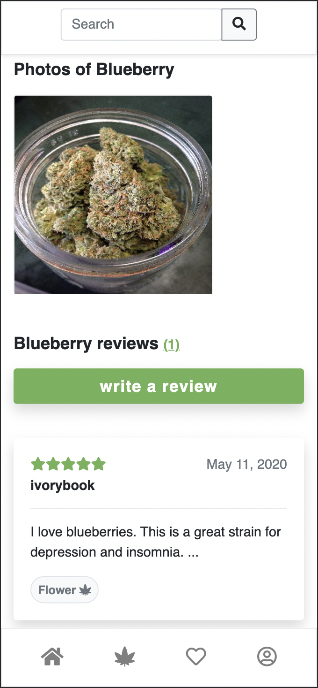
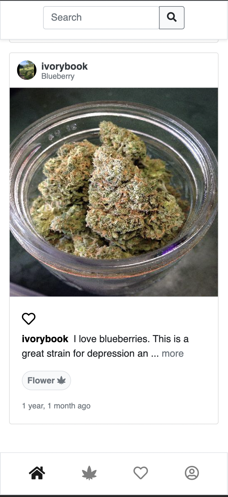

# Canvas Reviews

Canvas is a Django photo sharing application where users
can review, like, and post different methods of consuming
cannabis strains.

## Installation

Create an environment for the application dependencies using an environment manager of your choice. See [virtualenv](https://virtualenv.pypa.io/en/latest/) or [conda](https://docs.conda.io/en/latest/).

```bash
conda create --name $ENVIRONMENT_NAME python
```

Activate the environment.

```bash
conda activate $ENVIRONMENT_NAME
```

Use the package manager [pip](https://pip.pypa.io/en/stable/) to install 
the dependencies located in requirements.txt.

```bash
python -m pip install -r requirements.txt
```

Create a table in PostgreSQL and [configure the setings.py](https://docs.djangoproject.com/en/3.2/ref/settings/) located in the canvas directory.

Make the migrations.

```bash
python manage.py makemigrations
```

Apply the changes to the database.

```bash
python manage.py migrate
```

Run the server.

```bash
python manage.py runserver
```

## Images

Mobile


<br/>

<br/>



